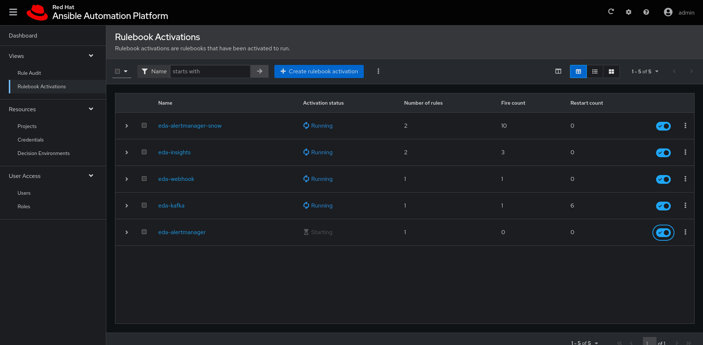
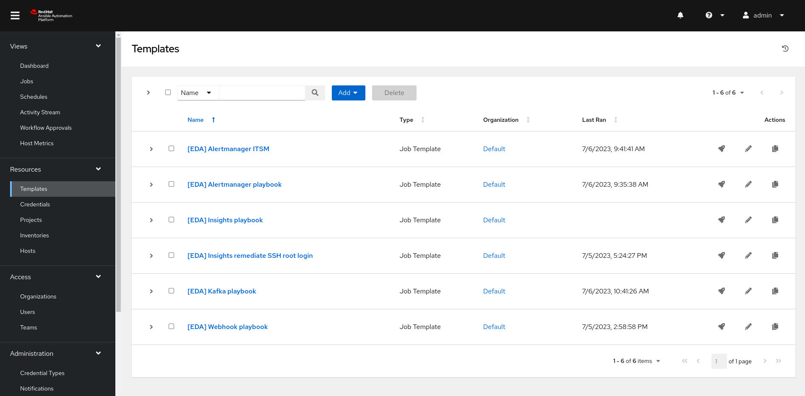

# Introducing Ansible Event Driven Automation

This repo helps in showcasing event driven automation using Event Driven Automation with Ansible.

Currently it is possible to try it out both in a containerized version and using [Red Hat Ansible Automation Platform](https://www.redhat.com/en/technologies/management/ansible)

To try the containerized version, go in the [EDA Containerized Demo folder](./eda-podman-demo/)

# EDA Ansible Automation Platform Demo

This section handles configuration and preparation to showcase Event Driven Automation leveraging the EDA Controller component in Red Hat Ansible Automation Platform 2.4.

## AAP2 configuration

First you need to [install Ansible Automation Platform](https://access.redhat.com/documentation/en-us/red_hat_ansible_automation_platform/2.4/html/red_hat_ansible_automation_platform_installation_guide).

In the [eda-demo-setup directory](./eda-demo-setup/) you will find some useful playbooks to create all necessary resources in the platform to showcase the use cases.

## Requirements

### Network

Some of the use cases (Webhook, Insights, Alertmanager) will need the following ports to be opened on the EDA Controller component:

    5000/tcp - Webhook
    5001/tcp - AlertManager
    5002/tcp - Insights

The Red Hat Insights use case will require that the EDA Machine is reachable from outside your network.

You can use [ngrok](https://ngrok.com/) to set-up a temporary public address to use for the use case.

### Middleware

The AlertManager and Kafka use cases require a working configuration for them, you can spin up a quick environment using the [podman-compose](./tests/podman-compose.yml) file in the **tests** directory.

This will spin a Kafka and AlertManager instance running on the host and listening to all interfaces. Tune up the settings based on your needs.

**!!! IMPORTANT !!!**

The kafka rulebook expects an advertised listener matching the one you will configure in the playbook. Please tune up the Podman compose file to replace _KAFKA_ADVERTISED_LISTENERS: "PLAINTEXT://<ADVERTISED_HOST/IP>:<PORT>"_ field to match your setup.

### Service Now Instance

One of the use cases include using a [Service Now instance](https://developer.servicenow.com/), you can easily sign-up and get one.

To playbooks in [the configuration folder](./eda-demo-setup/) already have the needed bits to configure credentials and variables to match your instance details.

### Dynatrace integration

The use cases contain a Dynatrace integration.
To configure the integrations, ensure you use your API URL and API Token configured with the following permissions in the [dynatrace rulebook](./eda-ansible/eda-rulebook-dynatrace.yml):

- Read/Write problems
- Read/Write configuration
- Access problem and event feed, metrics, and topology

## Running the Demo

After the configuration, this is the finalized setup:

### Testing the webhook integration

You can use the following cURL command to trigger a **webhook** automation:

    curl -X POST **EDA_CONTROLLER_HOSTNAME:5000** -d '{"name":"greeting","message":"hello"}'

### Testing the alertmanager integration

You can use the following cURL command to trigger a **Alertmanager** automation:

    curl -H 'Content-Type: application/json' -d '[{"labels":{"alertName":"my-eda-alert", "alertMessage": "This is a test alert firing", "alertTargetHosts": "localhost"}}]' http://localhost:9093/api/v1/alerts

### Testing the Kafka integration

A script in the [tests/kafka directory](./tests/kafka/) allows to connect to a _--host_ (defaults to localhost) on port 9092 and send a test message to trigger automation

    python3 tests/kafka/kafka-sender.py --host MY_KAFKA_HOST
