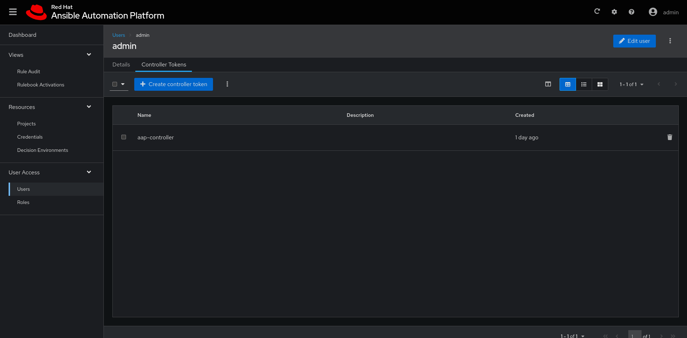

# General configuration variables

The file [common_vars.yml](./common_vars.yml) contains the common variables for configuring the use cases and token exchange:

    aap2_controller_host:
    aap2_controller_username:
    aap2_controller_password:

    eda_controller_url:
    eda_controller_user:
    eda_controller_password:

## Automation controller setup

Once your setup is in place, you need to generate a token, that will be used by EDA Controller to connect to the Automation Controller. To do so, you can go in the **Users -> admin -> Token** section in the controller and _ADD_ a new token.

Save the token and open the EDA Controller URL, go in the **Users -> admin -> Token** section and _Create controller token_

Alternatively, you can use the [configure-controller-token playbook](./configure-controller-token.yml)

To configure the predefined project, credentials and templates, you can use the playbooks located in the [eda-demo-setup directory](./).

The _configure-aap-controller_ playbook, requires an ansible-galaxy configuration that allows accessing [Red Hat Automation Hub](https://access.redhat.com/documentation/en-us/red_hat_ansible_automation_platform/2.4/html-single/getting_started_with_automation_hub/index)

First, install the requirements:

    ansible-galaxy install -r requirements.yml

## Use case setup

Each use case utilizes different variables to setup the EDA Controller and AAP Controller and create the respective projects, credentials, and all needed resources.

In this folder you will find all the variables files named this way:

    use-case-*-setup.yml

Each use case will define additional variables that are needed for the configuration, like credentials and/or endpoints.

Example for Service Now integration:

    servicenow_instance_url:
    servicenow_instance_user:
    servicenow_instance_password:

Example for Kafka integration:

    kafka_advertised_listener:

There is also a general file [use-case-full-setup.yml file](./use-case-full-setup.yml) to configure all of them at once.

These variables will be used to configure both the AAP2 Controller and the EDA Controller.

You can then run the two playbooks to complete the configuration, passing the right configuration file during execution:

    ansible-playbook configure-aap-controller.yml -e @variable-file.yml
    ansible-playbook configure-eda-controller.yml -e @variable-file.yml
